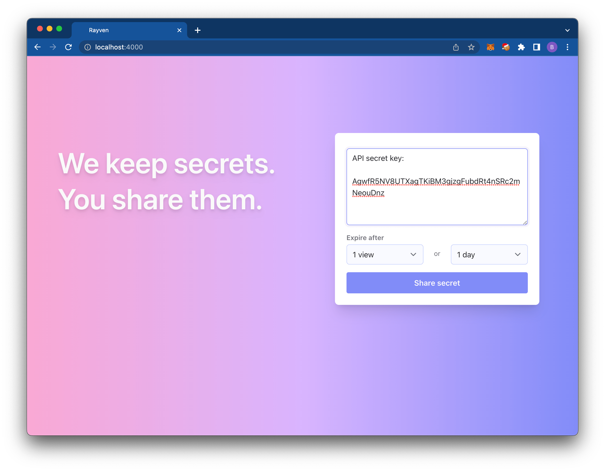
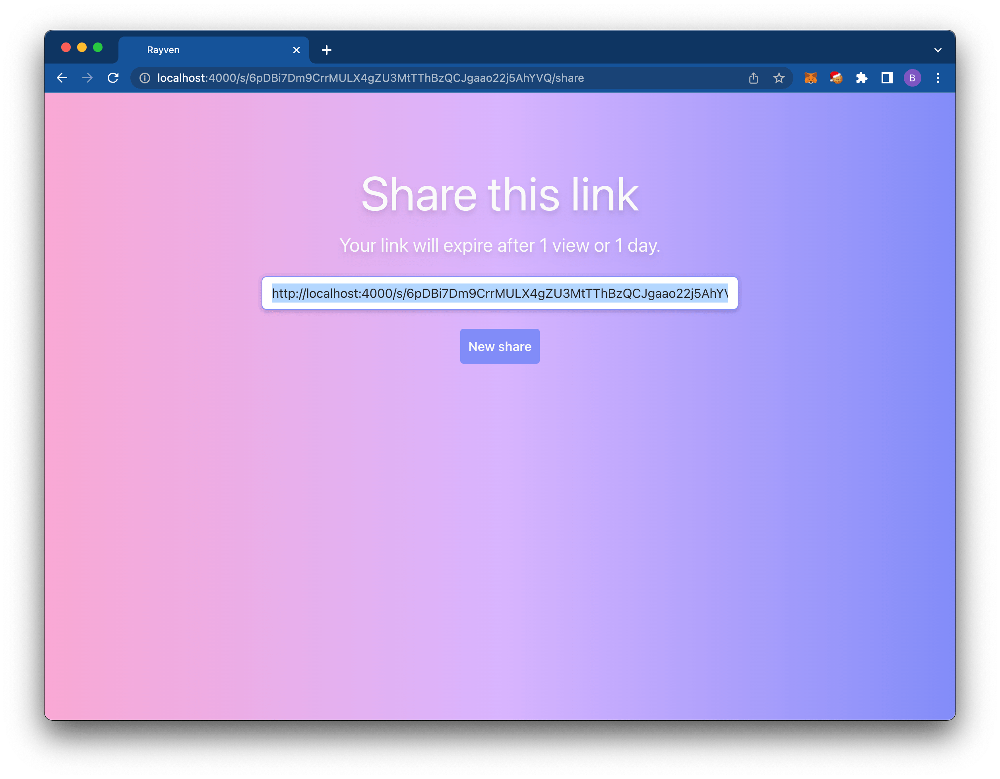
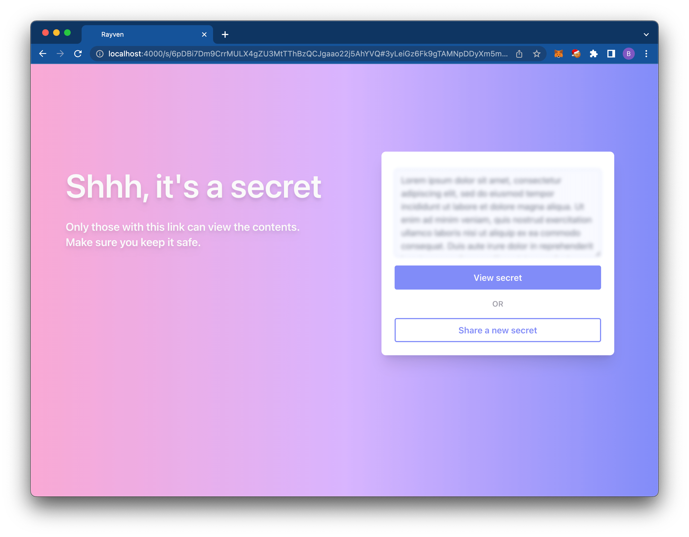
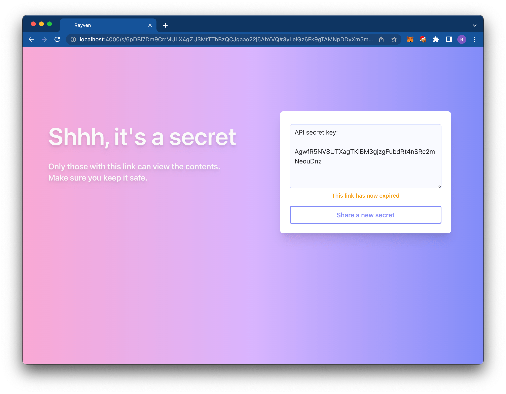

# Rayven

Private and secure data sharing application.

## Who is this for

Rayven is primarily intended for companies that want to give their employees a private and secure way to share sensitive information. However, it is available for anyone to use for any purpose.

## Why Rayven?

There are a number of ways to share some data online. Email, Slack, Dropbox, Google Drive, etc. However, most of the ways people share online are not private or secure. Most products out there are able to see the data people upload.

Sensitive values, like passwords, private keys, SSNs, photos of driver licenses, etc., should be kept secret between the sender and the recipient only. End-to-end encryption is a tool that can help keep data private and secure, available only to the sender and recipient.

There are a couple of products out there that use end-to-end encryption for exactly this purpose. But the ones I know about are not open source and are therefore hard or impossible to fully audit.

Rayven intends to be a fully open source alternative to something like [Doppler Share](https://share.doppler.com) and [Wormhole](https://wormhole.app). It's goals are:

* Support private and secure data sharing via end-to-end encryption.
* Open source the application so anyone can use it and so that it can be thoroughly audited.
* Support for both small text blobs and large files.
* (Potentially) support for encrypting data under someone elses' public key (e.g., a bitcoin or ethereum address).
* And more

## Screenshots

**⚠️ User interface is a work in progress.**

User wants to share a secret value with someone, like an API secret key.



After creating the link, the user can copy the share link and share it with whomever.



When someone receives a share link, they can view it.





## How it works

1. Rayven allows users to enter something they'd like to securely share.
2. It is encrypted on the client and the encrypted result is sent to the server along with some values (max views, expiration date) that configure when this data is no longer valid and should be deleted.
3. User receives a share link that contains the encryption key in the URL's hash (NOTE: the key is never sent to the server).
4. User can share out the link to whomever. Anyone possessing the link can access the data, assuming it's not yet expired.

For specific details on the cryptography, please see [the crypto](assets/js/crypto) README and code.

## Deployment instructions

Coming soon.

## Credits

Thanks to [Doppler Share](https://share.doppler.com) and [Wormhole](https://wormhole.app) for inspiration.

## Development

To start your Phoenix server:

  * Install dependencies with `mix deps.get`
  * Create and migrate your database with `mix ecto.setup`
  * Start Phoenix endpoint with `mix phx.server` or inside IEx with `iex -S mix phx.server`

Now you can visit [`localhost:4000`](http://localhost:4000) from your browser.

### Tests

```bash
mix test
mix test path/to/test/folder/or/file.exs
```
